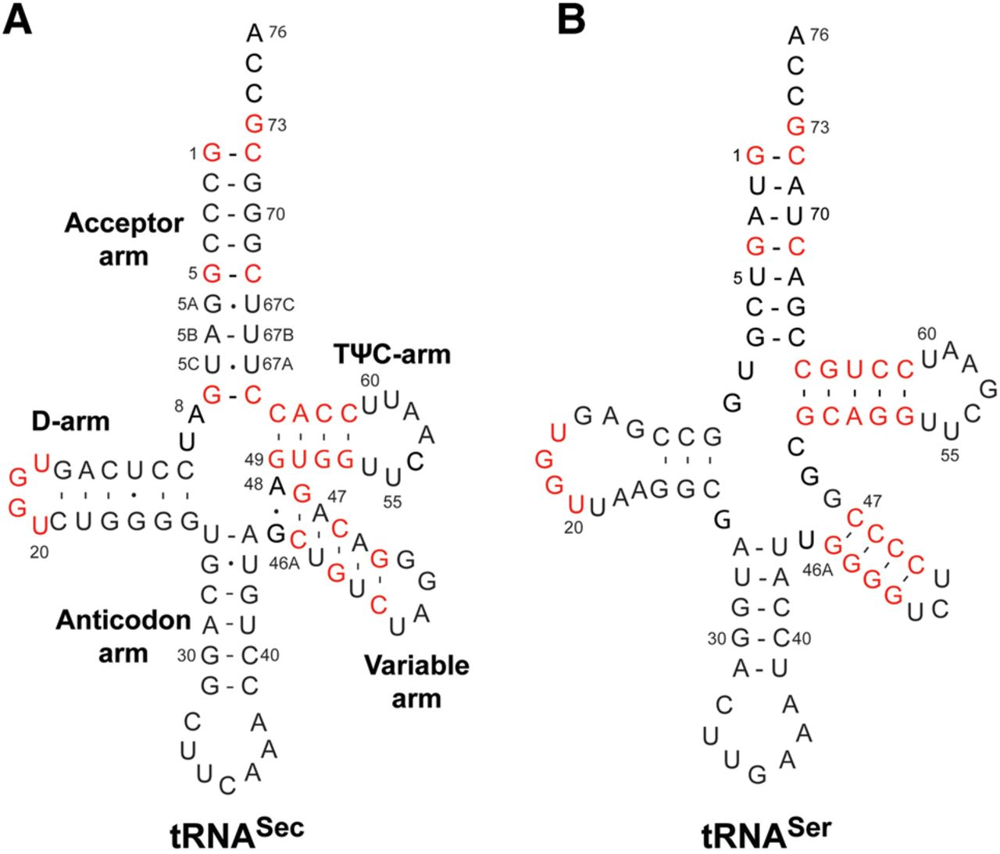

# 🧬 tRNA-Sec Overview

## Introduction
Traditionally, cellular *RNA molecules* were classified into three main categories: *messenger RNAs* (*mRNAs*), *ribosomal RNAs* (*rRNAs*), and *transfer RNAs* (*tRNAs*), which are involved in *protein synthesis*. However, with the advent of *high-throughput sequencing technologies*, the existence of numerous additional classes of RNA with *regulatory functions* that transcend these classic roles was revealed [1].

In this context, *non-coding RNAs* (*ncRNAs*)—molecules that are *not translated into proteins*—were found to be *ubiquitous* and surprisingly *abundant*, representing approximately four times more transcripts than *mRNAs* in human cells [2,3]. Despite their widespread presence, their functions in mammals remain *largely uncharacterized* [1,3].

*ncRNAs* can be classified as *structural* and *regulatory* (Figure 1) [4]. *Structural ncRNAs* include *tRNA* and *rRNA*, as described above. *Regulatory ncRNAs*, on the other hand, are subdivided according to their length into two categories: *small non-coding RNAs* (*sncRNAs*), which are molecules of *up to 200 nucleotides* and include the classes *siRNAs* (*small interfering RNAs*), *miRNAs* (*microRNAs*), *piRNAs* (*PIWI-interacting RNAs*), and *snoRNAs* (*small nucleolar RNAs*), which perform *essential functions* in biological processes such as *translation inhibition* or *metabolic modulation*; and *long non-coding RNAs* (*lncRNAs*), which are *longer than 200 nucleotides* and comprise the *majority of nuclear ncRNAs*.

   
  <em>Figure 1. Classification of <i>ncRNAs</i> into <i>structural</i> and <i>regulatory</i>. 
  <i>Structural ncRNAs</i> include <i>tRNAs</i> and <i>rRNAs</i>, while <i>regulatory ncRNAs</i> 
  are subdivided into <i>sncRNAs</i> (&lt;200 nt, such as <i>miRNAs</i>, <i>piRNAs</i>, and <i>siRNAs</i>) 
  and <i>lncRNAs</i> (&gt;200 nt, with multiple subcategories depending on their genomic origin). 
  Taken from Ahmad et al. (2021).</em>

---

## tRNAs: canonical and non-canonical functions and structure

Within the category of *sncRNAs*, *tRNAs* constitute a classic group. Discovered more than 60 years ago, their structural study was key to understanding the mechanisms of *translation*. Their canonical function is to act as *essential adapter molecules* in *protein synthesis*, facilitating *mRNA decoding* and *polypeptide assembly* in ribosomes. However, they also perform *non-canonical functions*, participating in processes such as *cell signaling*, *cell survival*, *apoptosis*, *amino acid* and *porphyrin metabolism*, and *stress response programs*.

In terms of their structure, *tRNAs* have:
• A secondary *“cloverleaf” structure* with five main domains: the *acceptor stem* (*CCA end*), the *D arm* (*dihydrouridine loop*), the *T arm* (*TΨC loop*), the *anticodon loop*, and the *variable loop*.
• An *“L-shaped” tertiary structure*, resulting from the three-dimensional folding of these domains.
• An average size of *70 to 90 nucleotides*, although some are larger; for example, *tRNASec*, with *90 to 101 nucleotides*, is the longest known *tRNA*.

*tRNAs* are also the *RNA molecules with the highest density of post-transcriptional modifications*. Of the more than 170 chemical modifications described in *RNA*, about *100 are found in tRNAs*, with an average of *13 per molecule in eukaryotes* and about *8 in bacteria*. These modifications, located mainly in the *anticodon loop* and in the body of the *tRNA*, constitute a true *“epitranscriptomic code”* that modulates the *efficiency* and *plasticity of translation* [5]. Many are introduced by highly conserved specific enzymes (*writers*), and Figure 2 shows a representative diagram of the modified positions in human cytoplasmic *tRNAs* and the enzymes that generate them [6].

   
  <em>Figure 2. Schematic representation of <i>chemical modifications</i> present in 
  <i>human cytoplasmic tRNAs</i> and their associated <i>enzymes</i>. 
  The main <i>modified nucleotide positions</i> and the <i>specific enzymes</i> 
  responsible for their incorporation are indicated. 
  Taken from Zhang &amp; Lu (2025).</em>

---

## tRNA-derived Fragments

*tRNAs* are a significant source of small *ncRNAs* called *tRNA-derived fragments* (*tsRNAs*) [1]. These are *not random degradation byproducts*, but rather originate from the action of *specific nucleases* on *precursor* or *mature tRNAs* under conditions of *stress*, *infection*, or *tumorigenesis*. *TsRNAs* are divided into two major subtypes: *tRNA halves* or *tiRNAs* (*30–40 nt*), generated mainly by cleavage in the *anticodon region*, and *tRNA-derived fragments* (*tRFs*), which are *shorter* (*18–30 nt*) and include five classes: *tRF-5s*, derived from the *5' end* of *mature tRNA*; *tRF-3s*, with the *CCA motif* at the *3' end*; *tRF-1s*, which come from the *trailer sequence* of *pre-tRNA*; *tRF-2s*, which cover the *central region of the anticodon*; and *i-tRFs*, which include segments of the *anticodon loop* together with regions of the *D* and *T loops* [1,3].

Functionally, *tsRNAs* regulate key processes such as *translation inhibition*, *ribosome biogenesis*, and *epigenetic modulation*. Their *dysregulation* is closely associated with *human diseases*, especially *cancer*, where they are being investigated as *biomarkers* for *diagnosis* and *prognosis* [7]. In addition, *post-transcriptional modifications* in *tRNAs* directly influence the *biogenesis* and *function* of these fragments.

   
  <em>Figure 3. Biogenesis of <i>tRNA-derived fragments</i> (<i>tsRNAs</i>). 
  The main <i>cleavage sites</i> in <i>pre-tRNAs</i> and <i>mature tRNAs</i>, 
  generated by different <i>nucleases</i> (Dicer, RNase Z, angiogenin, among others), are shown. 
  <i>TsRNAs</i> are classified into <i>tRNA halves</i> (tiRNAs) and <i>tRNA-derived fragments</i> 
  (tRFs: tRF-1, tRF-2, tRF-3, tRF-5, and i-tRFs). Taken from Fu &amp; Xu (2022).</em>

---

## The Special Case of tRNA-Sec

*tRNASec* is an exception within the *tRNA* repertoire because it has a unique architecture and incorporates a non-standard amino acid, *selenocysteine* (*Sec*), which is considered the *21st amino acid* [8–10].

### *Biosynthesis of Selenocysteine*

Unlike the 20 standard amino acids, which have their own specific synthetases, the biosynthesis of *Sec* occurs directly on *tRNASec* in a multi-step process [11]. The molecule is first aminoacylated with *serine* by *seryl-tRNA synthetase* (*SerRS*). In eukaryotes and archaea, serine is then phosphorylated to *O-phosphoserine* by *O-phosphoseryl-tRNA kinase* (*PSTK*) and subsequently converted to *Sec* by the enzyme *O-phosphoseryl-selenocysteyl synthase* (*SepSecS*), which uses *selenophosphate* as a selenium donor. In bacteria, this intermediate phosphorylation step does not occur, and the conversion to *Sec* is catalyzed directly by *selenocysteine synthase* (*SelA*) [9,11].

### *Mechanism of Sec Insertion During Translation*

The insertion of *Sec* during translation depends on an unusual mechanism. *tRNASec* has the anticodon *UCA*, which is complementary to the *UGA codon*, a sequence that normally serves as a *termination signal* [8]. In mRNAs that encode *selenoproteins*, a cis-motif called *SECIS* (*Selenocysteine Insertion Sequence*) allows the *UGA codon* to be reinterpreted as *Sec*. This process involves specialized elongation factors: *SelB* in bacteria and *eEFSec* in eukaryotes/archaea, which recognize the charged *tRNASec* and interact with the *SECIS*. In bacteria, this element is found in the coding region immediately after the *UGA codon*, enabling direct binding of *SelB*. In eukaryotes, however, the *SECIS* is located in the *3′UTR*, so the interaction requires the *SBP2 cofactor* to recruit *tRNASec* to the ribosome [8,9,11]. This re-coding of a stop codon to direct the incorporation of *Sec* ensures the synthesis of *selenoproteins*, which are essential for *redox homeostasis* and various metabolic processes (Figure 4) [12].

   
  <em>Figure 4. Structure of <i>human tRNASec</i> and its comparison with other <i>tRNAs</i>. 
  Human tRNASec is shown as a <i>cloverleaf model</i> (A), <i>ribbon model</i> (D), and 
  <i>tertiary interaction diagram</i> (G). For comparison, <i>T. thermophilus tRNASer</i> 
  [PDB ID: 1SER (38)] (B, E, H) and <i>S. cerevisiae tRNAPhe</i> [PDB ID: 4TNA (47)] (C, F, I) are shown. 
  The <i>acceptor stem</i>, <i>AD link</i>, <i>D arm</i>, <i>anticodon arm</i>, <i>extra arm</i>, and 
  <i>T arm</i> are colored red, purple, blue, green, yellow, and orange, respectively. 
  Adapted from Itoh et al. (2009).</em>

### Key Structural Features of tRNASec

Structurally, *tRNASec* is the *longest known tRNA*, with approximately *90–101 nucleotides*, compared to the typical ~75 nucleotides of canonical tRNAs.
Compose by
* **Acceptor-TΨC Stem**: This stem is significantly longer, reaching *13 base pairs* (bp), which is much more than the typical 12 bp in standard tRNAs. This is distributed as a 9/4 configuration in eukaryotes and archaea, or 8/5 in bacteria.
* **D Arm**: It has an extended D arm of *6–7 bp* with a reduced loop of ~4 nucleotides.
* **Variable Arm**: This arm is exceptionally long, forming a *stem-loop* of about *16 nucleotides* in eukaryotes.

These structural peculiarities prevent the formation of the *compact tertiary core* found in conventional tRNAs. Instead, they create an *open cavity*, which provides *structural flexibility* [14]. A highly conserved *guanine at position 73 (G73)* acts as a key *discriminating base* for recognition by the enzymes in the selenocysteine pathway [12,15].

   
  <em>Figure 5. Comparison between <i>human tRNASec</i> (A) and <i>tRNASer</i> (B), 
  shown in <i>cloverleaf representation</i>. 
  <i>tRNASec</i> adopts a <i>9/4 configuration</i> in contrast to the <i>canonical 7/5 fold</i> of tRNASer. 
  Conserved and similar sequences in the <i>acceptor stem</i>, <i>D arm</i>, <i>variable arm</i>, 
  and <i>TΨC</i> are highlighted in red. 
  Adapted from Holman et al. (2017).</em>

---

## References

1. Anderson, P.; Ivanov, P. *TRNA Fragments* in Human Health and Disease. *FEBS Lett* 2014, 588, 4297–4304.

2. Isakova, A.; Neff, N.; Quake, S.R. *Single-Cell Quantification* of a Broad *RNA Spectrum* Reveals Unique *Noncoding Patterns* Associated with Cell Types and States. *Proceedings of the National Academy of Sciences* 2021, 118, doi:10.1073/pnas.2113568118/-/DCSupplemental.

3. Fu, B.F.; Xu, C.Y. *Transfer RNA-Derived Small RNAs*: Novel Regulators and Biomarkers of Cancers. *Front Oncol* 2022, 12.

4. Ahmad, P.; Bensaoud, C.; Mekki, I.; Rehman, M.U.; Kotsyfakis, M. *Long Non-Coding RNAs* and Their Potential Roles in the Vector–Host–Pathogen Triad. *Life* 2021, 11, 1–12.

5. Suzuki, T. The Expanding World of *TRNA Modifications* and Their *Disease Relevance*. *Nat Rev Mol Cell Biol* 2021, 22, 375–392.

6. Zhang, M.; Lu, Z. *TRNA Modifications*: Greasing the Wheels of Translation and Beyond. *RNA Biol* 2025, 22, 1–25.

7. Jia, H.; Zhang, L. *TRNA-Derived Small RNAs* in *Disease Immunity*. *Theranostics* 2025, 15, 245–257.

8. Serrão, V.H.B.; Silva, I.R.; da Silva, M.T.A.; Scortecci, J.F.; de Freitas Fernandes, A.; Thiemann, O.H. The Unique *TRNASec* and Its Role in *Selenocysteine Biosynthesis*. *Amino Acids* 2018, 50, 1145–1167.

9. Chavatte, L.; Lange, L.; Schweizer, U.; Ohlmann, T. Understanding the Role of *TRNA Modifications* in *UGA Recoding* as *Selenocysteine* in Eukaryotes. *J Mol Biol* 2025, 437.

10. Commans, S.; Böck, A. *Selenocysteine Inserting TRNAs*: An Overview. *FEMS Microbiol Rev* 1999, 23, 335–351, doi:10.1111/j.1574-6976.1999.tb00403.x.

11. Itoh, Y.; Chiba, S.; Sekine, S.I.; Yokoyama, S. *Crystal Structure* of *Human Selenocysteine TRNA*. *Nucleic Acids Res* 2009, 37, 6259–6268, doi:10.1093/nar/gkp648.

12. Santesmasses, D.; Mariotti, M.; Guigó, R. *Computational Identification* of the *Selenocysteine TRNA* (*TRNASec*) in Genomes. *PLoS Comput Biol* 2017, 13, doi:10.1371/journal.pcbi.1005383.

13. Chiba, S.; Itoh, Y.; Sekine, S. ichi; Yokoyama, S. *Structural Basis* for the Major Role of *O-Phosphoseryl-TRNA Kinase* in the *UGA-Specific Encoding* of *Selenocysteine*. *Mol Cell* 2010, 39, 410–420, doi:10.1016/j.molcel.2010.07.018.

14. Itoh, Y.; Sekine, S.I.; Suetsugu, S.; Yokoyama, S. *Tertiary Structure* of *Bacterial Selenocysteine TRNA*. *Nucleic Acids Res* 2013, 41, 6729–6738, doi:10.1093/nar/gkt321.

15. Palioura, S.; Sherrer, R.L.; Steitz, T.A.; Soil, D.; Simonovic, M. The Human *SepSecS-TRNASec Complex* Reveals the Mechanism of *Selenocysteine Formation*. *Science (1979)* 2009, 325, 321–325, doi:10.1126/science.1173755.

16. Holman, K. M., Puppala, A. K., Lee, J. W., Lee, H., & Simonović, M. (2017). Insights into substrate promiscuity of human seryl-tRNA synthetase. Rna, 23(11), 1685-1699.
